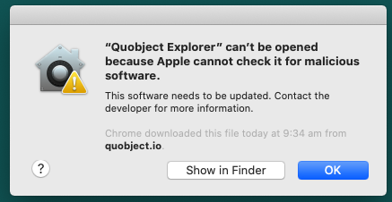

# Quobject help

## macOS

### Quobject Designer

#### Getting message: "Quobject Designer can’t be opened because Apple cannot check it for malicious software."

See [Issues #1](https://github.com/Quobject/quobject/issues/1)

#### Import csv file

[
https://apps.quobject.io/ImportExample_en.csv
](
https://apps.quobject.io/ImportExample_en.csv
)

# img tag:
```
<>
```


### Quobject Explorer

#### Getting message: "Quobject Explorer can’t be opened because Apple cannot check it for malicious software."




See [Issues #1](https://github.com/Quobject/quobject/issues/1)


#### Exporting quizzes into *.docx documents missing text

Export quiz to word docx in Quobject Explorer macos & windows - missing text when opening in Pages, Google docs, libreoffice. 

All created *.docx documents can currently only be opened in MS Word. 

Getting it working with Pages can be done by opening document in Microsoft Word and then Save As, and unchecking "Maintain compatibility with previous versions of Word".

The saved document can then be opened in Pages, Google docs, libreoffice... and all text will be visible

See [Issues #3](https://github.com/Quobject/quobject/issues/3)


[Support](http://support.quobject.io/)
© Copyright 2020 Quobject. All rights reserved.
